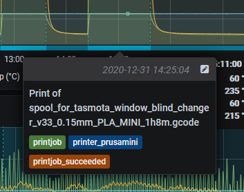

OctoPrint Grafana Annotations Plugin
=====================================

Send Annotations to Grafana to mark the begin and end times of your print jobs.  

[Annotations](https://grafana.com/docs/grafana/latest/dashboards/annotations/)
are timed event markers that can either be a discrete point in time, or be
a range with a beginning and an end.  They can also have description text, and support tags
so you can query them in your dashboards and overlay them onto your time series
plots.  

This plugin goes great with the [OctoPrint Prometheus Exporter](https://github.com/tg44/OctoPrint-Prometheus-Exporter) 
plugin, which can give you time series data about temperatures etc. to put on your fancy dashboards as a backdrop for these annotations.

Operation
---------

When a print job is started, a discrete event annotation will be sent to
Grafana to mark the start of the job.  Once the job is either cancelled or
completes normally, an update will be sent on the same annotation to give it an
end time and the configured outcome tags.

Setup
-----

Install the plugin via the Plugin Manager or manually using this URL:

	https://github.com/nathanic/OctoPrint-GrafanaAnnotations/archive/master.zip

Settings
-------------

You'll have to go into your Grafana settings page to generate an API key for this plugin to use.

It is also highly recommended that you fill in some tags to send on the annotations that identify 
the printer etc. in case you have multiple printers.

References
----------
 - [OctoPrint Plugin Tutorial](https://docs.octoprint.org/en/master/plugins/gettingstarted.html)
 - [Grafana Annotations HTTP API](https://grafana.com/docs/grafana/latest/http_api/annotations/) 
